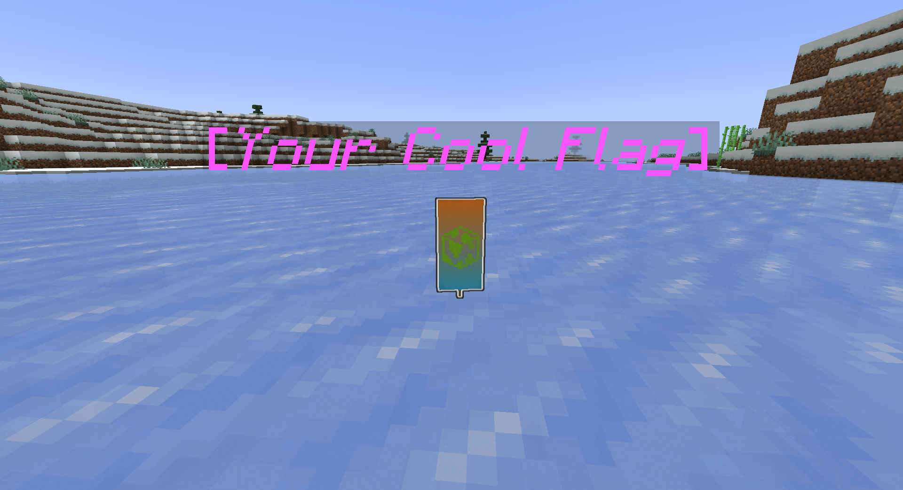
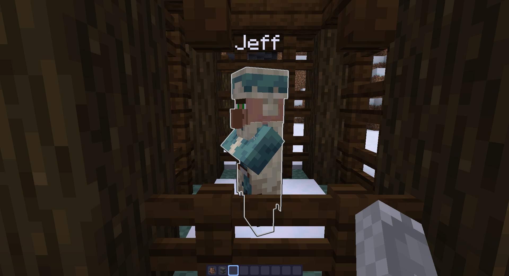
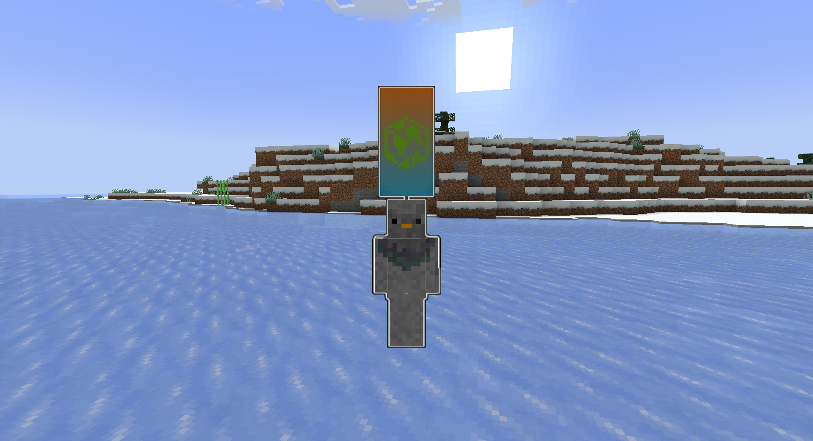
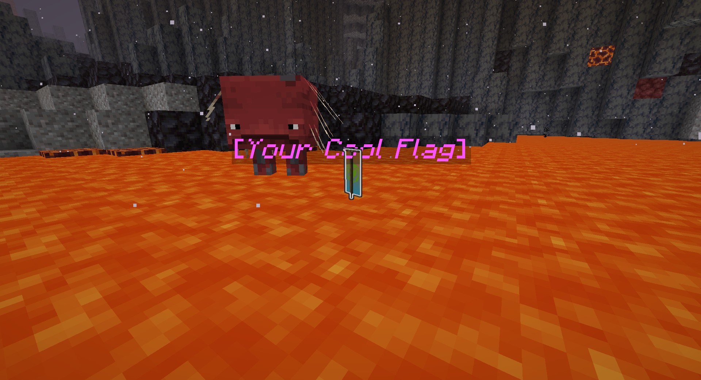

# CTF Buddy

CTF Buddy is your assistant for Capture The Flag style competition events in Minecraft running
on the [Paper](https://papermc.io/software/paper) server.

## Features

### Custom Flags

CTF Buddy doesn't have a prescribed flag item you have to use. CTF Buddy keeps track of items by
adding a piece of metadata to the item, then listens for events involving that item. This means
anything that you can hold in your hand can be a flag.

Want an entity instead? CTF Buddy can do that too! The plugin uses the same metadata system to
allow keeping track of marked entities, so you can use your favorite Villager or Creeper as a flag.

### Flag Visibility

Flags, and any entity carrying a flag, are given a glowing effect to make them easier to spot.
Additionally, entities holding a flag item will have their helmet slot replaced with the flag to
make them easy to spot (if a player had a helmet before, it will be safely placed in their
inventory).

By default, the plugin will shoot off firework particles every minute to help players find the
flags. This can be disabled if needed.

### Flag Persistence

CTF Buddy takes measures when an item is marked as a flag to make sure it is not easy for a flag
to be destroyed. Flag entities can only be harmed by creative mode players and will not despawn.
The plugin also prevents bringing flags to the end by default, where they could easily be lost to
the void.

### Logout Protection

Ever have a player log out with a flag in their inventory? Or put an entity in a boat and logged
out with it? CTF Buddy mitigates these issues. When a player logs out with a flag in their
inventory, the flag can be dropped at their feet, or the player butchered if that's your cup of
tea. If you like the entity style of flags, they are smart enough to eject themselves from a
vehicle if the player tries to log out with them.

### Logging

Need to figure out what happened to a flag? CTF Buddy logs to the server console whenever a player
picks up or drops a flag item. You can use this to track down who won at the end of an event,
or use to give players hints if needed.

## Usage

### `/makeflag`

CTF Buddy has only one command you need to know: `/makeflag`. Access to
this command is granted by the permission `ctfbuddy.makeflag`, which is granted to ops by default.
/makeflag has two subcommands: `item` and `entity`.

#### `item`

`/makeflag item` will mark the item in your hand as a flag. This will add the needed tracking
metadata for the plugin to find the item later, along with some other metadata to prevent
destruction of the flag.

#### `entity`

`/makeflag entity` will mark the entity you are looking at as a flag. This will add the needed
metadata to the entity to track it as a flag, along with some other metadata to prevent death of
the entity.

### Ending an event

CTF Buddy does not define how to end an event; that is left up to the event organizer. When you
are ready to dispose of the flags, they can be destroyed using creative mode. The destroy item
slot in the creative inventory will get rid of flag items, and flag entities can be damaged by
creative players like normal. The nearest void can also be used, if you want a more dramatic ending.

## Compatibility

CTFBuddy was built for Minecraft: Java Edition, running Paper or one of its
forks. Upstreams of Paper (Bukkit & Spigot) will *not* work, as this
plugin utilizes the expanded API provided by Paper.

Geyser is a bit problematic, due to a lack of important features in Bedrock Edition.
[Bedrock does not support glowing](https://wiki.geysermc.org/geyser/current-limitations/#:~:text=links%20in%20chat-,Glowing%20effect,-Crafting%20in%20the),
which may make locating the flag harder for those players. Additionally,
[Bedrock also does not support blocks on entity heads](https://wiki.geysermc.org/geyser/current-limitations/#:~:text=Blocks%20(excluding%20jack%2Do%2Dlantern)%20on%20entity%20heads%20(E.G.%20armor%20stands%2C%20players)),
meaning the flag may not be visible on entities carrying them.

## bStats

This plugin uses [bStats](https://bstats.org/), the common service used by most plugins and server
software, to keep track of basic stats. You can opt out of bStats for all plugins and your server
software by editing the `plugins/bStats/config.yml` file that is generated on the server's first
launch.